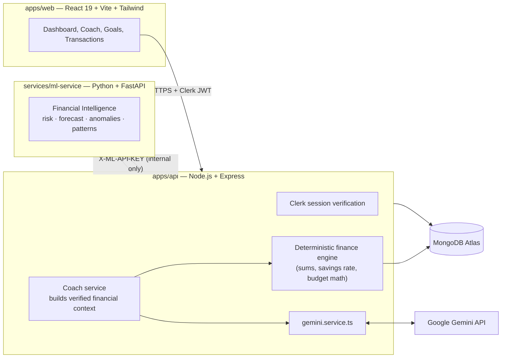

<div align="center">

# 💰 Finora AI

### Your Personal AI Financial Coach

Track spending, set savings goals, and get honest financial guidance — grounded in your real numbers, not guesses. Finora combines deterministic financial math, a statistical intelligence engine, and Gemini-powered coaching into one system that never fabricates a number.

[](https://react.dev/)
[](https://www.typescriptlang.org/)
[](https://vitejs.dev/)
[](https://tailwindcss.com/)
[](https://nodejs.org/)
[](https://fastapi.tiangolo.com/)
[](https://www.mongodb.com/atlas)
[](https://clerk.com/)
[](https://ai.google.dev/)
[](https://vercel.com/)
[](https://render.com/)

**[🚀 Live Demo](#-live-demo)** · **[Use Cases](#-use-cases)** · **[Architecture](#-architecture)** · **[Getting Started](#-getting-started)**

</div>

---

## 🚀 Live Demo

> **👉 This is the one place to put your deployed link.**

```markdown
### 🔗 [finora.vercel.app](https://your-live-link-here.vercel.app)
```

Replace the URL above once `apps/web` is deployed to Vercel. Two honest notes worth keeping here once it's live:
- The API (`apps/api`) and ML service both run on Render — if either is on a free tier that spins down when idle, the first request after inactivity can take ~30–50 seconds.
- A working demo needs a **Clerk** account to sign in — mention that plainly rather than let a visitor wonder why they're prompted to sign up.

---

## 💡 Why This Project

Most "AI finance" demos either let the LLM invent numbers or skip the hard part (actual financial math) entirely. Finora is built around one non-negotiable rule, stated directly in its own architecture docs: **the LLM never computes — it only reads pre-verified numbers.** Every balance, savings rate, risk score, and forecast is computed deterministically in Node.js or by an explicit statistical method in the Python service *before* Gemini ever sees it. Gemini's job is narrow and honest: explain, contextualize, and answer — never calculate.

## 🎯 Use Cases

| Use Case | How Finora helps |
|---|---|
| **Personal budgeting** | Log income/expenses, see category breakdowns and monthly trends computed deterministically — no estimates dressed up as facts |
| **"Can I afford this?" questions** | Ask the Coach in plain language; it answers using your actual computed balance and spending, not a generic guess |
| **Savings goal tracking** | Set a goal, see exactly how much you need to save monthly to hit it, computed from real progress |
| **Spending risk awareness** | The intelligence engine flags an honest risk level (low/moderate/high) based on your actual expense-to-income ratio |
| **Catching unusual spending** | Statistical anomaly detection flags transactions that deviate significantly from your own category averages — not a fixed threshold that ignores your habits |

### Known Scope & Limitations
- **Not financial advice.** The system prompt explicitly instructs Gemini to decline professional/legal financial advice and to recommend a qualified advisor for high-stakes decisions — worth stating just as plainly here.
- **Forecasting is intentionally simple.** Expense forecasting uses honest least-squares trend analysis over your own monthly history (with a trailing-average fallback when there isn't enough data) — not a trained machine-learning model. This is a deliberate choice documented in the codebase, not a limitation to hide.
- **Receipt scanning, budgets, smart notifications, and statement import are designed but not yet built** — see [Roadmap](#-roadmap). Per the project's own "no fake features" rule, unbuilt features aren't wired up to look like they work.

---

## 🏗️ Architecture

Three separate services, each with one job:



**Rules that never change, straight from the project's own architecture doc:**
- The browser only ever talks to `apps/api`. The ML service is never publicly reachable.
- `apps/api` is the only caller of both Gemini and `services/ml-service`.
- The LLM only sees numbers the analytics engine already verified — it never invents a number.
- All monetary amounts are stored and transported as **integer paise** (not float currency), validated server-side.

**Resilience detail worth knowing:** if the Python ML service is unreachable, `apps/api` falls back to computing an equivalent intelligence result itself (`computeNodeIntelligence`) rather than failing the request outright — same response shape either way.

---

## 🛠️ Tech Stack

| Service | Technologies |
|---|---|
| **apps/web** | React 19, Vite 6, TypeScript, Tailwind CSS 4, TanStack Query, React Router 7, Framer Motion, Recharts |
| **apps/api** | Node.js, Express, TypeScript, Mongoose, Zod validation, express-rate-limit, Helmet |
| **services/ml-service** | Python, FastAPI, Pydantic, pandas, NumPy |
| **Auth** | Clerk (hosted sign-in/sign-up, JWT session verification) |
| **Database** | MongoDB Atlas |
| **AI** | Google Gemini API (`@google/genai`) — coaching and explanation only, never computation |
| **Deployment** | Vercel (web) · Render (api + ml-service) · MongoDB Atlas |

---

## 📁 Project Structure

```
finora-ai/
├── apps/
│   ├── web/                 # React + Vite frontend
│   │   └── src/
│   │       ├── components/  # coach/, dashboard/, goals/, intelligence/, transactions/
│   │       ├── routes/      # Dashboard, Coach, Goals, Transactions, Analytics, Intelligence
│   │       └── lib/         # API clients + React Query hooks per domain
│   └── api/                 # Node.js + Express backend
│       └── src/
│           ├── modules/     # analytics/, coach/, goals/, health/, intelligence/, transactions/, users/
│           ├── models/      # AiConversation, Transaction, User
│           ├── services/    # gemini.service, mlClient.service, transaction.service, user.service
│           └── middleware/  # auth (Clerk), validate (Zod), errors
├── services/
│   └── ml-service/          # Python + FastAPI intelligence engine
│       └── app/
│           ├── analysis/    # anomalies, forecasting, patterns, risk
│           ├── api/routes/  # analyze, detect, intelligence, predict
│           └── features/    # feature preparation from raw transaction history
└── docs/                    # architecture.md, api-design.md, database-schema.md, ai-prompts.md
```

---

## 🚀 Getting Started

### Prerequisites
- Node.js ≥ 20
- Python ≥ 3.12
- A MongoDB Atlas cluster (or local MongoDB)
- A [Clerk](https://clerk.com/) application (for auth keys)
- A [Google Gemini API key](https://aistudio.google.com/apikey)

### 1. Clone the repository

```bash
git clone https://github.com/<your-username>/finora-ai.git
cd finora-ai
```

### 2. `apps/api` (port 4000)

```bash
cd apps/api
cp .env.example .env   # fill in real values — see Environment Variables below
npm install
npm run dev
```

### 3. `services/ml-service` (port 8000)

```bash
cd services/ml-service
python -m venv .venv
.venv/Scripts/python -m pip install -r requirements.txt   # Windows
# source .venv/bin/activate && pip install -r requirements.txt   # macOS/Linux
.venv/Scripts/python -m uvicorn app.main:app --reload --port 8000
```

### 4. `apps/web` (port 5173)

```bash
cd apps/web
cp .env.example .env   # fill in VITE_CLERK_PUBLISHABLE_KEY
npm install
npm run dev
```

Vite proxies `/api` → `http://localhost:4000` in development.

---

## 🔑 Environment Variables

**`apps/api/.env`**

| Variable | Description |
|---|---|
| `PORT` | Port the API runs on (default `4000`) |
| `CLERK_SECRET_KEY` / `CLERK_PUBLISHABLE_KEY` | Clerk application keys |
| `CLERK_JWT_KEY` | Optional PEM public key for offline/networkless session verification (dev/test only) |
| `MONGODB_URI` | MongoDB Atlas (or local) connection string |
| `GEMINI_API_KEY` | Google Gemini API key (never exposed to the frontend) |
| `GEMINI_MODEL` | Gemini model to use for the Coach |
| `ML_SERVICE_URL` | URL of the running ML service |
| `ML_SERVICE_API_KEY` | Shared internal key between `apps/api` and `services/ml-service` |
| `CORS_ORIGIN` | Allowed browser origin |

**`apps/web/.env`**

| Variable | Description |
|---|---|
| `VITE_CLERK_PUBLISHABLE_KEY` | Clerk publishable key |
| `VITE_API_BASE_URL` | Base path for API calls (`/api` in dev via the Vite proxy) |

**`services/ml-service/.env`**

| Variable | Description |
|---|---|
| `ML_SERVICE_API_KEY` | Must match the value in `apps/api/.env` |
| `DEBUG` | `true`/`false` — enables permissive CORS for local debug only |

> ⚠️ Never commit `.env` files — already excluded via `.gitignore`.

---

## 📡 API Overview

All routes below require `Authorization: Bearer <Clerk session JWT>` except health.

| Method | Path | Description |
|---|---|---|
| `GET` | `/api/v1/health` | Service + MongoDB connection health |
| `GET` | `/api/v1/users/me` | Current authenticated user |
| `GET` / `POST` | `/api/v1/transactions` | List (paginated, filterable) / create a transaction |
| `GET` / `PATCH` / `DELETE` | `/api/v1/transactions/:id` | Fetch / update / delete, owner-scoped |
| `GET` | `/api/v1/analytics/summary` | Balance, income/expense, savings rate, deterministic summary |
| `GET` / `POST` | `/api/v1/goals` | List / create savings goals |
| `PATCH` / `DELETE` | `/api/v1/goals/:id` | Update / delete, owner-scoped |
| `POST` | `/api/v1/coach/query` | `{ question }` → Gemini-grounded answer, rate-limited |
| `GET` | `/api/v1/intelligence` | Risk score, next-month forecast, anomalies, and category patterns |

**Internal only** (`services/ml-service`, never reachable from the browser): `POST /api/v1/financial-intelligence`, authenticated by `X-ML-API-KEY`.

---

## ☁️ Deployment

| Component | Platform |
|---|---|
| `apps/web` | [Vercel](https://vercel.com/) — static build, frontend-only env vars |
| `apps/api` | [Render](https://render.com/) — `npm run build && npm start` |
| `services/ml-service` | [Render](https://render.com/) — uvicorn, internal-only, never public |
| Database | [MongoDB Atlas](https://www.mongodb.com/atlas) |

---

## 🗺️ Roadmap

Straight from the project's own phased design — nothing here is wired up to fake-work yet:

- [ ] **Budgets** — per-category monthly limits with current-month status
- [ ] **Insights & smart notifications** — cached AI/ML insights with acknowledgement tracking
- [ ] **Receipt scanning** — image upload → OCR → Gemini-extracted draft transaction, never auto-saved without confirmation
- [ ] **Bank statement import** — CSV/PDF → normalized rows with duplicate detection, applied only after user approval

---

## 🤝 Contributing

1. Fork the repo
2. Create a feature branch (`git checkout -b feature/amazing-feature`)
3. Commit (`git commit -m 'Add amazing feature'`)
4. Push (`git push origin feature/amazing-feature`)
5. Open a Pull Request

---

## 📄 License

No `LICENSE` file currently exists in this repository. If you want one, tell me which license (MIT is the common default for portfolio projects) and I'll generate it for you, matching what we did for your other project.

---

<div align="center">

Built with care — deterministic math first, AI second.

</div>
